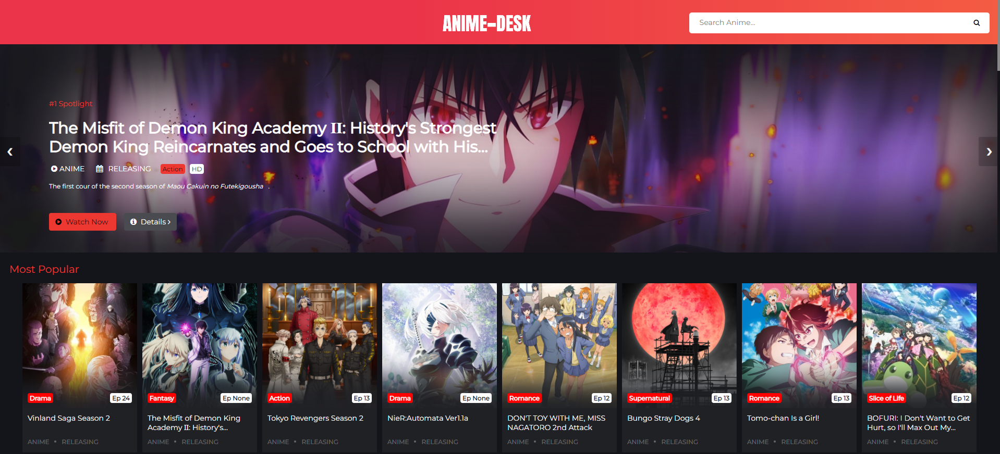

<p align="center"><a href="https://www.anime-desk.ru/"></a></p> 
<h1 align="center"></h1>
<h2 align="center"><b>Watch Animes Online For Free</b></h4>

<h5><p>1. Clone the project</p></h5>

```bash
https://github.com/nigdanil/anime-desk.git
```

<h5><p>2. Create venv for python</p></h5>

```bash
python -m venv venv

```

<h5><p>3. Activate venv for Windows</p></h5>

```bash
.\venv\Scricript\activate
```

<h5><p>4. Install all requirements</p></h5>
```bash
pip install -r requirements.txt
```
<h5><p>5. Run Flask app</p></h5>
```bash
flask run
```
